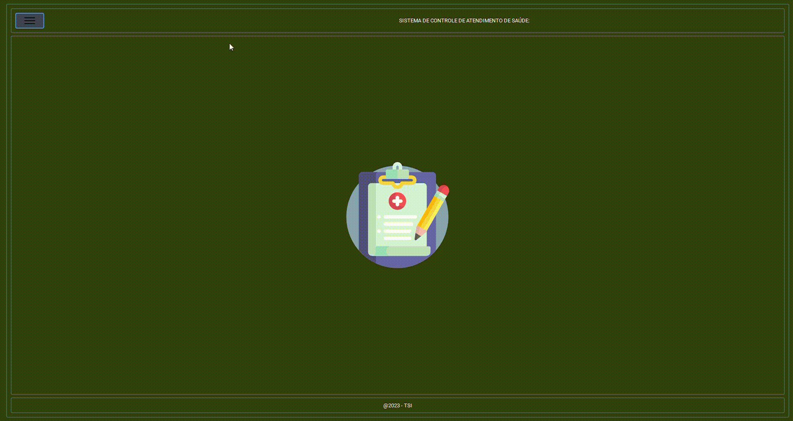
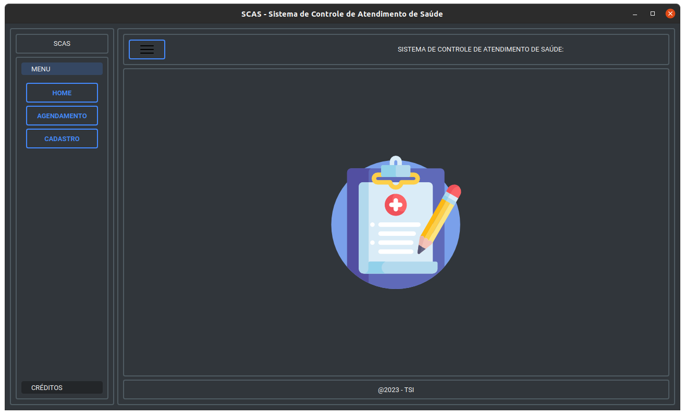
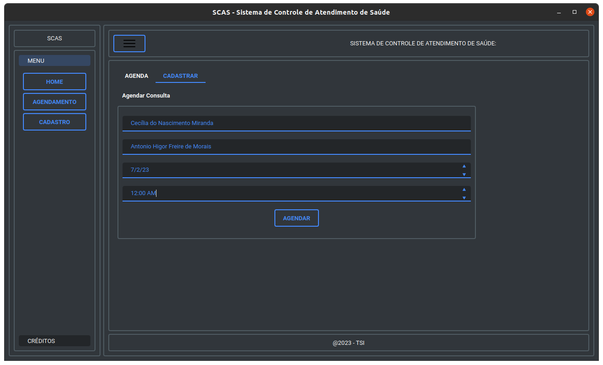
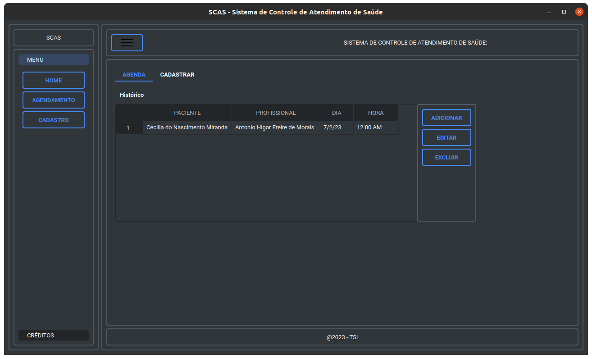
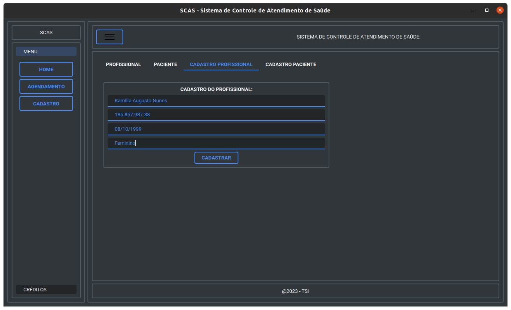
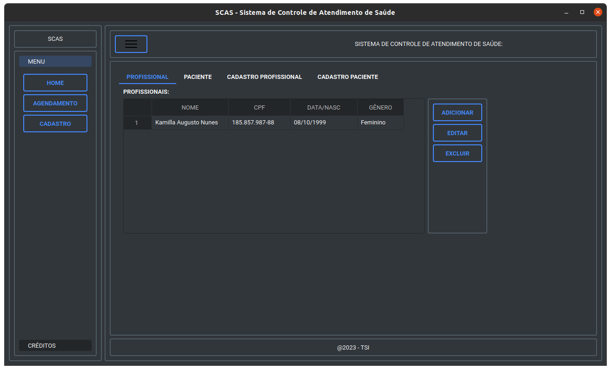
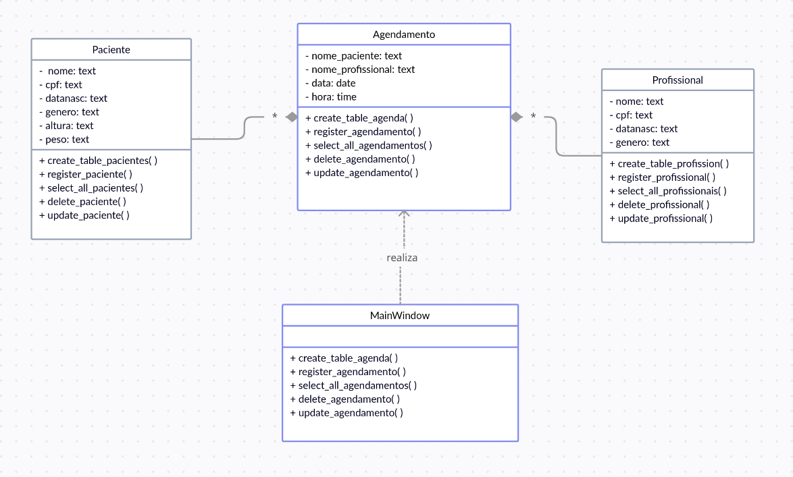
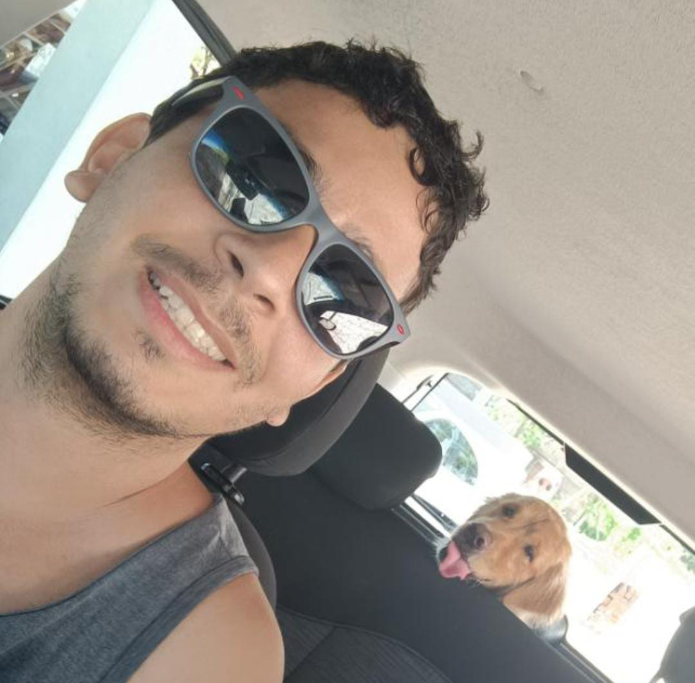

<h1 align="center">Sistema para Controle de Atendimentos de Saúde - SCAS</h1>

<p align="center">Este projeto é uma aplicação desenvolvida com o framework QT e o SGBD Sqlite3, com o objetivo de fornecer uma solução eficiente para o gerenciamento e controle de consultas em hospitais ou clínicas.</p>

<p align="center">
 <a href="#Funcionalidades">Funcionalidades</a> •
 <a href="#pre-requisitos">Pré Requisitos</a> •
 <a href="#executando-o-projeto">Executando o Projeto</a> •
 <a href="#utilizar">Como Utilizar</a> •
 <a href="#uml">Diagrama Uml</a> •
 <a href="#tecnologias">Tecnologias</a> •
 <a href="#autor">Autores</a>
</p>



---

<h3 id="Funcionalidades">Funcionalidades</h3>

- [x] Permite o cadastro de pacientes (inclusão, exclusão e edição);
- [x] Permite o cadastro de profissional (inclusão, exclusão e edição);
- [x] Realiza agendamento de atendimento com data/hora, paciente e profissional de saúde;
- [x] Possibilita a consulta dos atendimentos realizados
- [x] Roda em diferentes sistemas Operacionais (Windows, Linux, Mac)

---

<h3 id="pre-requisitos">Pré Requesitos</h3>

Antes de iniciar, é necessário ter instalado uma IDE (Ambiente de Desenvolvimento Integrado), o software Python na sua máquina e o sistema de controle de versão GIT.

- [Visual Studio Code](https://code.visualstudio.com/)
- [Python](https://www.python.org/downloads/)
- [Git](https://git-scm.com/downloads)

Além disso, você deve realizar a instalação dos seguintes pacotes:

- [Pyside6](https://pypi.org/project/PySide6/)
- [Qt_material](https://pypi.org/project/qt-material/)

---

<h3 id="executando-o-projeto">Executando o Projeto</h3>

```bash

# Execute o VisualStudioCode

# Abra um terminal diretamente no VisualStudioCode

# Clone este repositório
$ git clone https://github.com/QtDesigner-Python/Qt.git

# Com os pacotes de pyside6 e o qt_material ja instalados, execute a aplicação
$  No botão executar no canto superior direito

```

---

<h3 id="utilizar">Como utilizar o software: </h3>
<br>

<p> A tela HOME é o ponto de partida do aplicativo, a partir dela conseguimos visualizar nossas principais ferramentas e utildades </p>

<br>

<p> Acessando o menu de agendamento conseguimos fazer o cadastro de novos atendimentos</p>

<br>

<p> No menu agendamento na aba de AGENDA conseguimos visualizar todos os agendamentos feitos, bem como adicionar, editar e excluir os agendamentos já existentes. </p>

<br>

<p> Na aba de CADASTRO é possível cadastrar e gerir os cadastros dos pacientes e profissionais </p>

<br>

<p> Acessando a tela de CADASTRO nas abas PROFISSIONAL ou PACIENTE é possível visualizar as pessoas inseridas fazendo a manutenção de seu cadastro  </p>


---

<h3 id="uml">Diagrama UML</h3>



<h3 id="tecnologias">Tecnologias</h3>

As seguintes ferramentas foram usadas na construção do projeto:

- [QtCreator](https://www.qt.io/product/development-tools)
- [Sqlite](https://sqlite.org/index.html)
- [Pyside6](https://pypi.org/project/PySide6/)

---

<h3 id="autor">Autores</h3>

<div style="display: flex; gap: 30px">
    <span><a href="https://github.com/brunopithon">
        
        <p>Bruno Pithon</p>
    </a></span>
    <span><a href="https://github.com/PauloMonteiro98">
        
        <p>João Paulo</p>
    </a></span>
      <span><a href="https://github.com/RenanTuribio">
        
        <p>José Renan</p>
    </a></span>
      <span><a href="https://github.com/jhonyalife">
        
        <p>Jhony Alife</p>
    </a></span>
      <span><a href="https://github.com/TiagoAlvesBrito">
        
        <p>Tiago Alves</p>
    </a></span>
</div>
